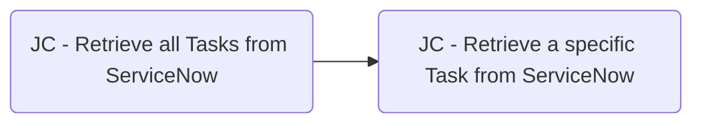
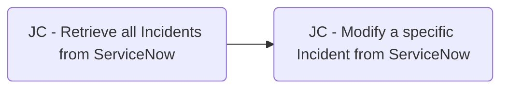
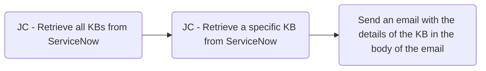

### Composite Skills
The Watsonx Orchestrate ServiceNow API includes skills that can only be used in a composite Skill Flow.

<b>List of Provided Composite Skills</b>

##### Composite Skill - Retrieve a Task record in ServiceNow

##### Composite Skill - Retrieve a specific KB in ServiceNow

##### Composite Skill - Retrieve a Incident record in ServiceNow

##### Composite Skill - Modify a specific Task in ServiceNow

##### Composite Skill - Modify a specific Incident in ServiceNow

See [Provided Composite Skills](/GettingStarted/skills#composite-skills)

### Create a composite Skill Flow
#### Steps:
To put these skills to use, create a composite skill flow:
1. Click the hamburger menu icon at the top left of the page, then click "Skills"
2. Next to the "Add skills" box on the right, click the downward facing arrow
3. Click "Create a Skill flow"

An empty skil flow has been created. Now we must name and add skills to the skill flow
:::tip
In order to add any skills to a skill flow, they must already be added to your [Personal Skills](addingskills)
:::

### Adding skills to the composite skill flow
You must add one of the [Top Level Skills](/GettingStarted/skills#top-level-skills) to its correesponding [Composite Skills](/GettingStarted/skills/#composite-skills) in order to properly flow the inputs and outoputs as such:

#### Examples:

#### Steps:
1. Name your skill flow. For this example we'll use "JC - Retrieve a task from ServiceNow"
2. Add one of the [Top Level Skills](/GettingStarted/skills#top-level-skills) to your skill flow
    :::note
    Here you must use one of the [Top Level Skills](/GettingStarted/skills#top-level-skills) to retrieve whichever table is needed. For this example we'll use the Tasks ServiceNow table and "JC - Retrieve all Tasks from ServiceNow" skill.
    :::
    1. Click the (+) button
    2. Add the a Top Level skill, such as "JC - Retrieve all Tasks" 
    3. When added click the skill and select "Input" tab and check the box "Hide this form from the user"
    4. Click "Output" and check the box "Hide this form from the user"
3. Add one of the Composite Skills to your skill flow
    1. Click the (+) button
    2. Add the "JC - Retrieve a specific Task skill"
    3. When added click the skill and select "Input" tab and check the box "Hide this form from the user"
    4. Click the box under where it says sys_id
    5. Click the previous skill (in our example case "JC - Retrieve all Tasks skill")
    6. Find and select sys_id under result / items
4. Save/Enhance/Publish the skill
    1. Next to the "Actions" box on the right, click the downward facing arrow
    2. Click save as draft
    3. Click "Enhance"
    4. Click "Publish"
5. Add the composite skill to from the skill catalog
    1. From the home screen, towards the bottom, click the "Add skills from the catalog" box
    2. Find your composite skill from the list and click "Add skill"

Your composite skill is now created. This enables us to use these ServiceNow skills and their outputs in a skill flow with any other Watsonx Orchestrate skill as such:
