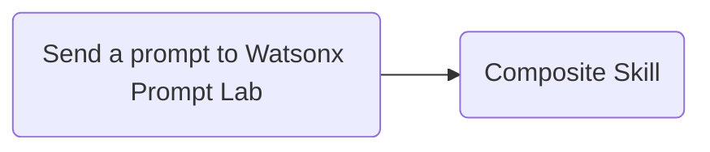
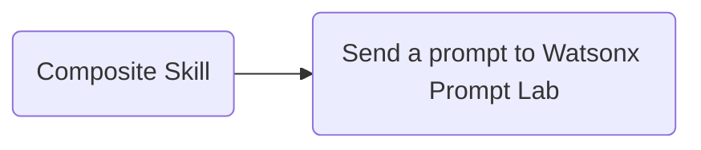
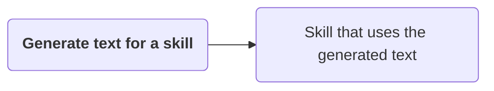
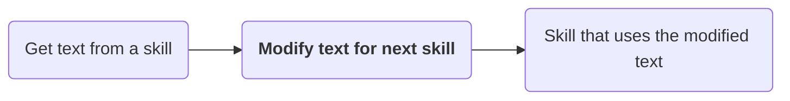
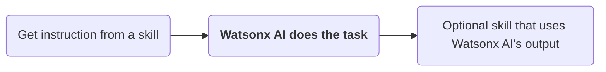
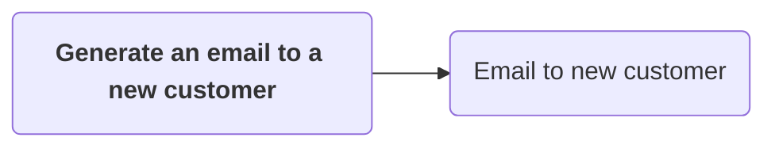
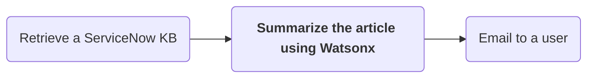

The Watsonx API includes skills that can be used in a composite Skill Flow. To put these skills to use, create a composite skill flow.
#### Steps

1. Click the hamburger menu icon at the top left of the page, then click "Skills"
2. Next to the "Add skills" box on the right, click the downward facing arrow
3. Click "Create a Skill flow"

An empty skil flow has been created. Now we must name and add skills to the skill flow
:::warning
In order to add any skills to a skill flow, they must already be added to your [personal skills](addingskills). Ensure that all skills you wish to use in composite skill flows have been added to your personal skills list.
:::

### Adding skills to the composite skill flow

You can use the "Send a prompt to Watsonx Prompt Lab" skill to send the generated text output as input to another skill:

You can also use another skill's output as the input for the "Send a prompt to Watsonx Prompt Lab skill":

:::tip
This enables us to use these Watsonx API skills and their outputs in a skill flow with any other Watsonx Orchestrate skill in a workflow as long as all parameters are defined. Don't think of it as simply sending a prompt, but a way to generate text, modify text, or instruct based on a text input.

Skills in <strong>bold</strong> below are the Watsonx API skill:

Examples:

:::